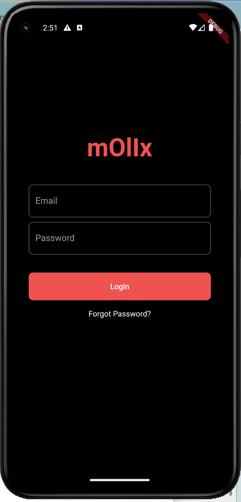
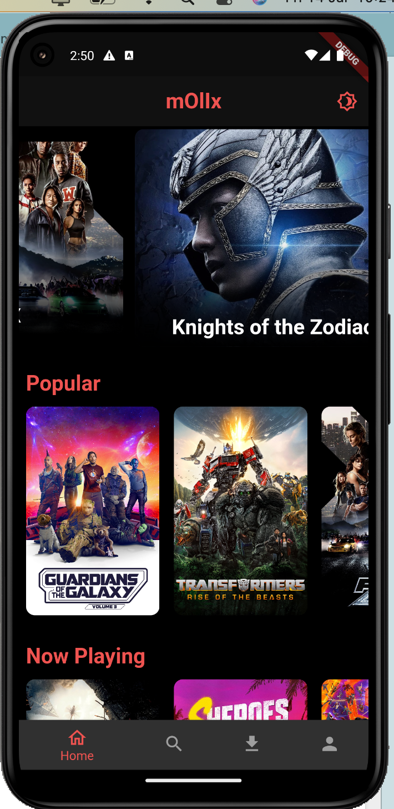
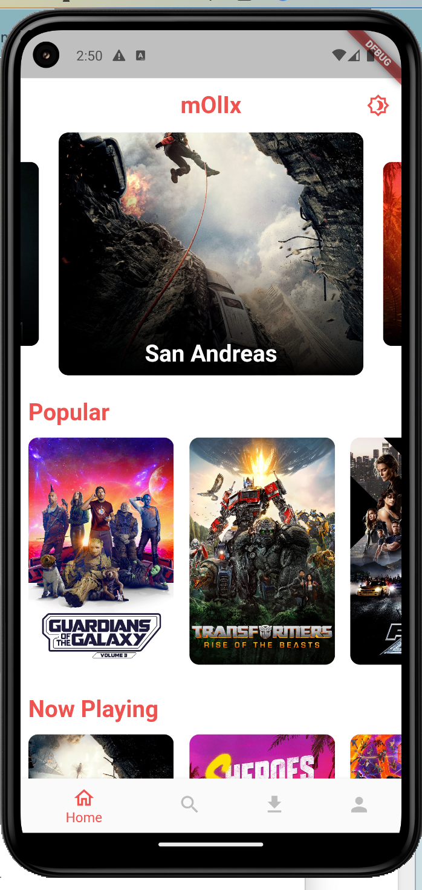
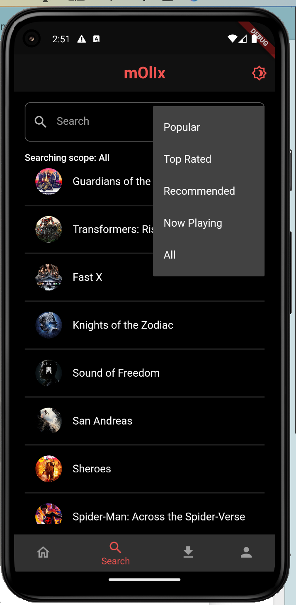
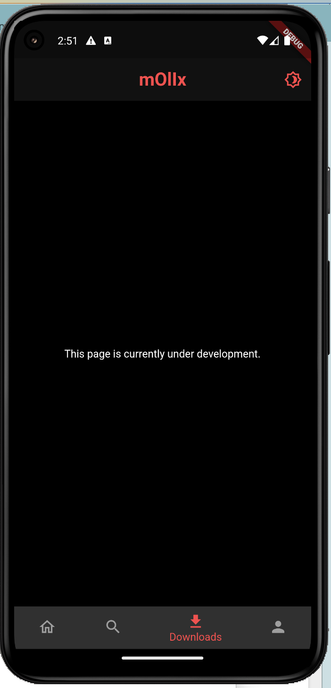
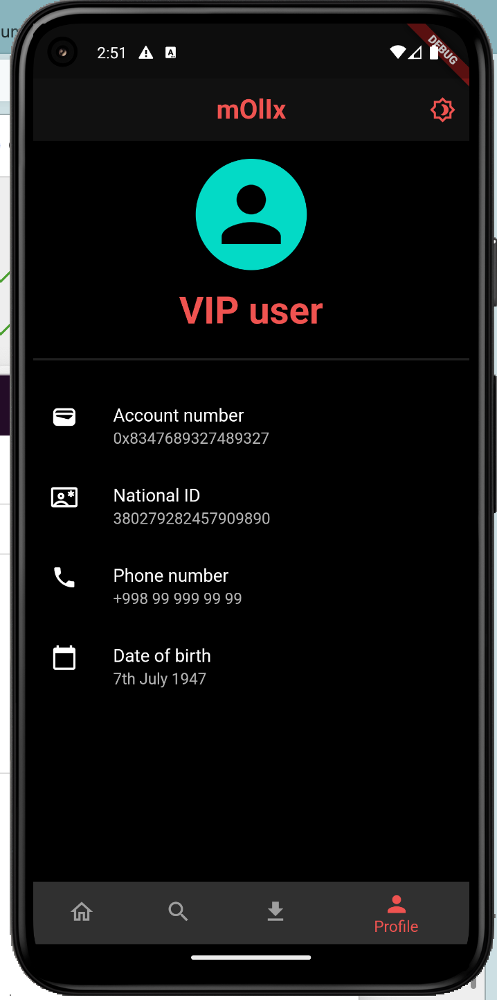

# molix

Molix is a Flutter app that allows you to create and manage your own lists of movies and series. You can use this app accross both mobile platforms i.e iOS and android.

## Getting Started

### Prerequisites to run the code
* [Flutter](https://flutter.dev/docs/get-started/install)
* [Android Studio](https://developer.android.com/studio) or [Visual Studio Code](https://code.visualstudio.com/)
* [Git](https://git-scm.com/downloads)
* [Xcode](https://developer.apple.com/xcode/) (MacOS only)

### Prerequisites to understand the codebase
* [Flutter](https://docs.flutter.dev/get-started/test-drive)
* [Dart](https://dart.dev/guides)
* [Provider](https://pub.dev/packages/provider)
* [BLoC](https://bloclibrary.dev/#/)
* [AutoRoute](https://pub.dev/packages/auto_route)

### Project Setup
* Clone the repository
* Open the project in Android Studio or Visual Studio Code
* Run `flutter pub get` to install dependencies
* Run `flutter run --flavor dev -t lib/main_dev.dart` to run the app in development mode
* Run `flutter run --flavor prod -t lib/main_prod.dart` to run the app in production mode
* Run `flutter build apk --flavor dev -t lib/main_dev.dart` to build the app in development mode
* Run `flutter build apk --flavor prod -t lib/main_prod.dart` to build the app in production mode

### Project Structure
* All the moddule are contained in the `features` directory inside the `lib` directory
* Each module has its own `bloc`, `views` and `repository` directory
* The `bloc` directory contains all the blocs related to that module
* The `views` directory contains all the views related to that module
* The `repository` directory contains all the repositories and models related to that module

### Code Contains
* Flavors
* Unit tests
* Widget tests
* BLoC pattern
* Theme management

### Screenshots
| Login Screen | Home Screen (dark) | Home Screen (light) | Search | Downloads | Profile |
|:--------:|:--------:|:--------:|:--------:|:--------:|:--------:|
|  |  |  |  |  |  |